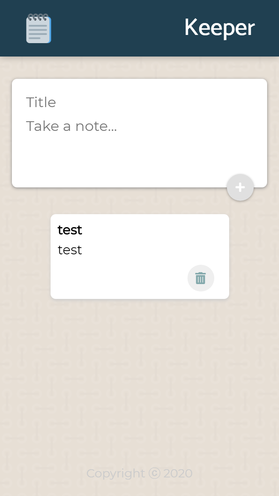

# Keeper

Keeper is for keeping all ur notes at one place.

Link [👨‍💻](https://m-keeper.netlify.app/)

# Images

## Learning

- .Map array method
- Usage of prevValue in React hooks
- Using some animation from materialUI library

## License

[MIT](https://choosealicense.com/licenses/mit/)
